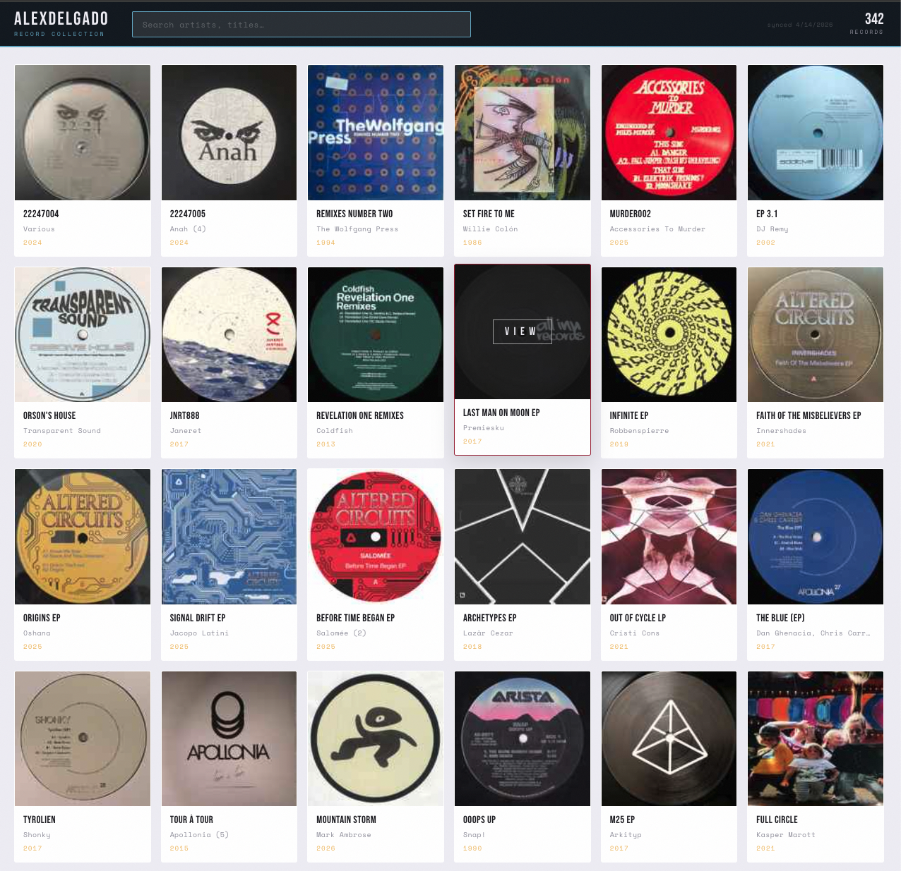
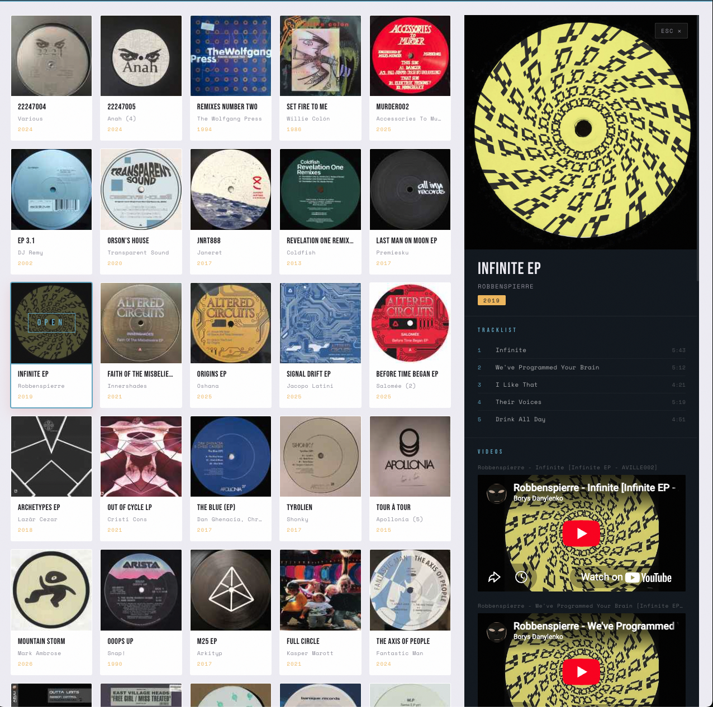

# Discogs Collection Viewer

A personal vinyl collection browser built with React, TypeScript, and Vite — deployed on Vercel. Browse your Discogs collection, search by artist or title, and click any record to view its tracklist and embedded YouTube videos.

---

## Screenshots

**Collection grid**


**Release detail panel**


---

## Features

- Grid view of your full Discogs collection with cover art, title, artist, and year
- Live search filtering by artist or title
- Slide-in detail panel on card click showing:
  - Full-size cover image
  - Tracklist with track positions and durations
  - Embedded YouTube videos (when available)
- Collection snapshot cached in Vercel Blob (refreshed daily via cron)
- Individual release details cached in Vercel Blob (30-day TTL)

---

## Tech Stack

| Layer | Technology |
|---|---|
| Frontend | React 19, TypeScript, Vite |
| Backend | Vercel Serverless Functions (Node.js runtime) |
| Storage | Vercel Blob |
| Data | Discogs API |
| Hosting | Vercel |

---

## Project Structure

```
├── src/
│   ├── App.tsx          # Main UI — collection grid + detail panel
│   └── App.css          # Styles
├── api/
│   ├── public/
│   │   ├── collection.ts  # GET /api/public/collection — serves cached snapshot
│   │   └── release.ts     # GET /api/public/release/:releaseId — release details
│   └── admin/
│       └── sync.ts        # GET /api/admin/sync — fetches & caches full collection
├── lib/
│   ├── types.ts           # Shared TypeScript types
│   ├── discogsClient.ts   # Discogs API pagination client
│   ├── normalize.ts       # Maps raw Discogs data to internal types
│   └── blobStore.ts       # Vercel Blob read/write helpers
└── vercel.json            # Cron schedule + URL rewrites
```

---

## Local Development

### Prerequisites

- Node.js 18+
- [Vercel CLI](https://vercel.com/docs/cli): `npm i -g vercel`
- A [Discogs personal access token](https://www.discogs.com/settings/developers)

### Setup

1. Clone the repo and install dependencies:
   ```bash
   npm install
   ```

2. Link to your Vercel project and pull environment variables:
   ```bash
   vercel link
   vercel env pull
   ```

3. Ensure the following are set in your Vercel project environment variables (Development):

   | Variable | Description |
   |---|---|
   | `DISCOGS_TOKEN` | Discogs personal access token |
   | `DISCOGS_USERNAME` | Your Discogs username |
   | `DISCOGS_USER_AGENT` | User-Agent string for Discogs API requests |
   | `BLOB_READ_WRITE_TOKEN` | Vercel Blob read/write token |
   | `ADMIN_SYNC_SECRET` | Secret header value for the sync endpoint |

4. Start the dev server (runs frontend + API functions together):
   ```bash
   vercel dev
   ```

5. Populate the collection snapshot on first run:
   ```bash
   curl http://localhost:3000/api/admin/sync -H "x-admin-secret: <your_secret>"
   ```

6. Open [http://localhost:3000](http://localhost:3000).

---

## API Endpoints

### `GET /api/public/collection`
Returns the full cached collection snapshot from Vercel Blob.

### `GET /api/public/release/:releaseId`
Returns release details (tracklist, videos, cover image) for a single release. Validates that the release belongs to the collection, then fetches from Discogs and caches the result in Vercel Blob for 30 days.

### `GET /api/admin/sync`
Fetches the full collection from Discogs and writes a new snapshot to Vercel Blob. Requires either the `x-admin-secret` header or the Vercel cron `User-Agent`. Runs automatically every day at 06:00 UTC.

---

## Deployment

Push to `main` — Vercel deploys automatically. Environment variables are managed in the Vercel project dashboard.
